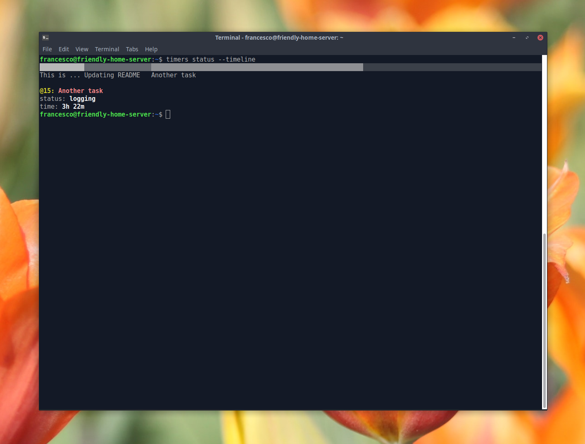

# `timers` - Command line time tracking tool

`timers` is a simple and effective time tracking tool with a easy-to-use
command line interface. With `timers` you can:

- Log time on tasks,
- Get a report on how much you worked each day of the week,
- Show a timeline with your tasks today,

`timers` is written in rust and uses simple text files to save the tasks, which make it
extremely fast and lightweight.



## Install

### Linux

On linux, just download the precompiled binary:

```bash
EXEC='/usr/local/bin/timers' && sudo wget https://github.com/frapa/timers/releases/latest/download/timers-linux -O $EXEC && sudo chmod +x $EXEC
```

To update, simply run the command again, it will overwrite the old version. To remove, type

```bash
EXEC='/usr/local/bin/timers' && sudo rm $EXEC
```

### Windows

Download and run installer from [here](https://github.com/frapa/timers/releases/latest).
To update, just install the new version. Remove like any other Windows program.

**Note:** Colored output is supported only by PowerShell and not by CMD. If you want to use the watch feature
you need to use a compliant terminal such as git bash.

## How to use

### The basics 

To start logging time on a task, you use the `log` (or `start`) sub-command, like this:

```bash
$ timers log "Writing timers readme"
@1: Writing timers readme
status: logging
time: 0s
```

The `@1` is the task id, that you can use to reference the task later.

If you were already logging a task, `timers` will ask if you want to stop the current task and start the logging
on the new one.
 
You can check the current logging status with `timers status`, which will print a message with the currently
logged task and the amount of time you have logged on it:

```bash
$ timers status
@15: Another task
status: logging
time: 1d 2h 42m

# We can pass --timeline to show a nice timeline of todays tasks
$ timers status --timeline
█████████████████████▒▒▓▓▓▓▓▓▓▓▓▓▓▓▓▓▓▓▓▓▓▓▓▓▓▓▓▓▓▓▓▓▓▓▓▓▓▓▓▓▓▓▓▓▓▓▓▓▓▓▓▓▓▓▓░░░░░░░░░░░░░░░░░░░░░░░
First task             Third task                                         

@15: Third task
status: logging
time: 1h 47m
```

Another cool option is `--watch` that keeps the status displayed in the console and updates it periodically
(this option is supported for git bash in Windows).

You can stop logging on a task with `timers stop`:

```bash
$ timers stop
@1: Writing timers readme
status: stopped
time: 19m 41s
```

You can then resume logging on a previous task by id, as follows:

```bash
$ timers log @1
@1: Writing timers readme
status: logging
time: 19m 41s
```

### Introspection commands

If you want to see the list of all your tasks, you can run `timers tasks`

```bash
$ timers tasks
ID     TASK                                 DURATION
----------------------------------------------------------
@1     My first task                        2h 44m 12s
@2     Another task                         3h 5m 47s
```

You can get a the total time logged with the `report` command.
It works like this:

```bash
$ timers report days  # Or even simply `timers report`
DAY          TIME LOGGED    TASKS
----------------------------------
Monday       8h 26m         3
Tuesday      7h 49m         4
Wednesday    8h 4m          6
Thursday     0s             0
Friday       0s             0
Saturday     0s             0
Sunday       0s             0
----------------------------------
Total        24h 19m        13
```

### "Advanced" features

You can start logging at a certain time with the `--at` option:

```bash
$ timers log "Your task" --at 10:34

# You can also set the time to yesterday, by prepending y
$ timers log "Your task" --at y10:34  # yesterday at 10:34

# Or you can use relative time with + and -
$ timers log "Your task" --at -10  # 10 minutes ago

# For custom things, you can specify the full local date with time
$ timers log "Your task" --at "2019-11-10 11:10"
```

The nice thing is that if you're already logging, it will end
the current task at the specified past time point, so no overlapping
tasks will be logged!

### Export

`timers` can export data into CSV format. You can either export logs
(which are the entries of when you started and stopped working on a task.
each task can have multiple logs), with the detailed start and end times,
or tasks, with aggregated duration.

To export use the `export` command, followed by the name of the thing you want
to export, as in

```bash
$ timers export logs
Task ID,Task name,Begin (UTC),End (UTC),Duration (hours)
1,My first task,2020-02-24T21:30:57.613882582+00:00,2020-02-26T20:36:44.803991524+00:00,47.09638888888889
1,My first task,2020-02-26T20:36:44.805320312+00:00,2020-02-26T20:43:54.642466170+00:00,0.11916666666666667
2,Another task,2020-02-26T20:43:54.643808060+00:00,2020-02-26T20:50:39.862161146+00:00,0.1125
...

$ timers export tasks
Task ID,Task name,Begin (UTC),End (UTC),Duration (hours)
Task ID,Task name,Logs,Duration (hours)
1,My first task,1,0.0022222222222222222
2,Another task,1,17.691944444444445
...
```

You can also save the data to a file and only export data between certain dates:

```bash
# Save to logs.csv
$ timers export logs -o logs.csv

# Export only the February 2020 logs (to date is not included)
$ timer export logs --from 2020-02-01 --to 2020-03-01
```

There are also other options, please consult the command line help for details.

## FAQ

**Why should I choose `timers` instead of any other time tracking tool?**

3 reasons:

- You like simple things like plain text files. Who ever want a database instead of those?
- Let your colleagues think you're a genius who's always mysteriously typing into a black box (the terminal).
- You believe global warming is a threat or you're laptop has a really shitty battery. 
- Colored terminal output. This alone would be enough do discard any competing tool.

**A command line tool? Come on, we're in the 2020s!**

Command line can be very simple and let me focus my energy on more important features.
Plus it's much more efficient (battery, memory, CPU) than any GUI tool,
or even worse web-based solution.

You're free to use your web-based tool that will eat 100 MB of your memory, download 10 Mb
of crap (including the very necessary 8 Mb of javascript code) just so you can click
the "log" button on a task.

**Where is my data stored? Are you stealing it?**

No way, it's all in the `.timers` folder inside your user folder (typically
`/home/<yourusername>/.local/share/timers_time_logs` on unix systems and `C:\Users\<yourusername>\AppData\Roaming\timers_time_logs`
on Windows).

**`timers` has a bug, what do I do?**

File a issue on the tab above. If the gods of the internet are favourable, I might
look into fixing it. Please provide a decent bug report.
